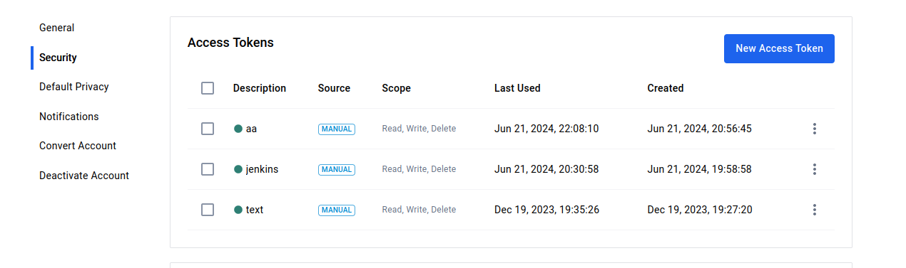
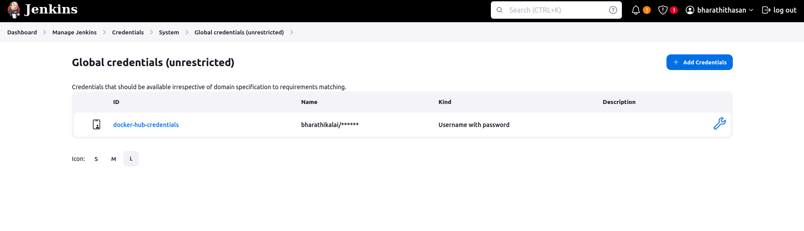
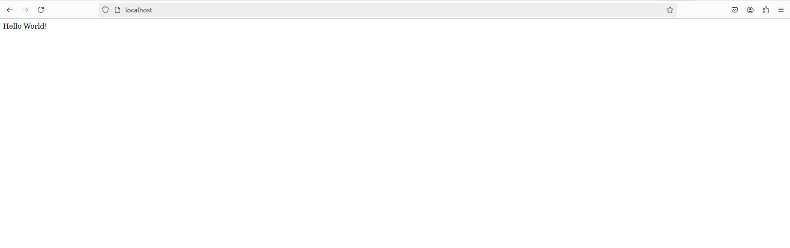

## STEP 1

## CREATE A docker-hub-credentials ID FROM DOCKER HUB

## STEP 2 

## SET THE docker-hub-credentials AS ENV IN JENKINS CREDENTIALS NOTE CREATE A ENV UNDER THE USER NAME AND PASSWORD USER NAME IS YOUR DOCKER HUB USER NAME AND ID IS docker-hub-credentials   PASSWORD IS YOUR TOKEN PASSWORD (STEP 1)

## OUTPUT 

### if you have any doubt  feel free t0 contact me on linkdin  USER NAME : Bharathi Thasan