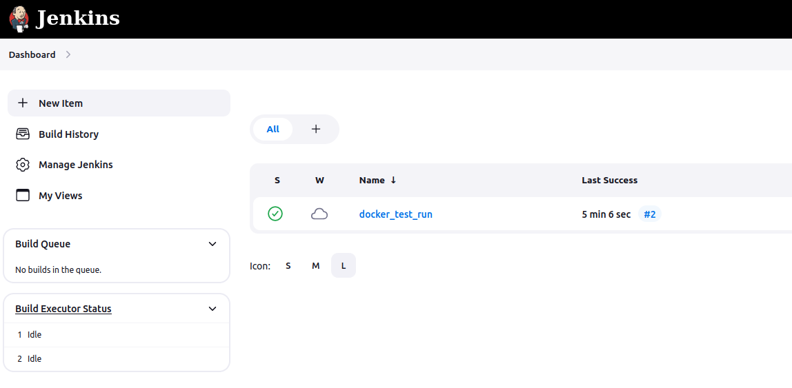
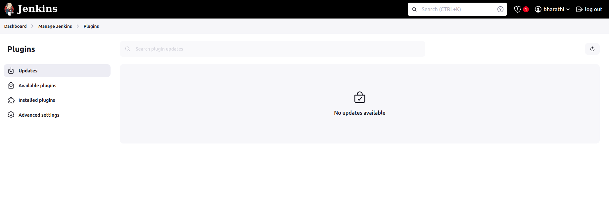
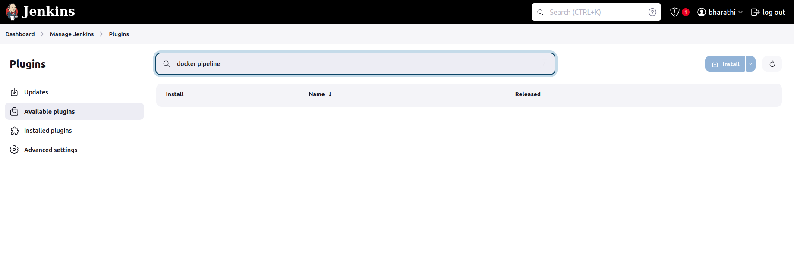
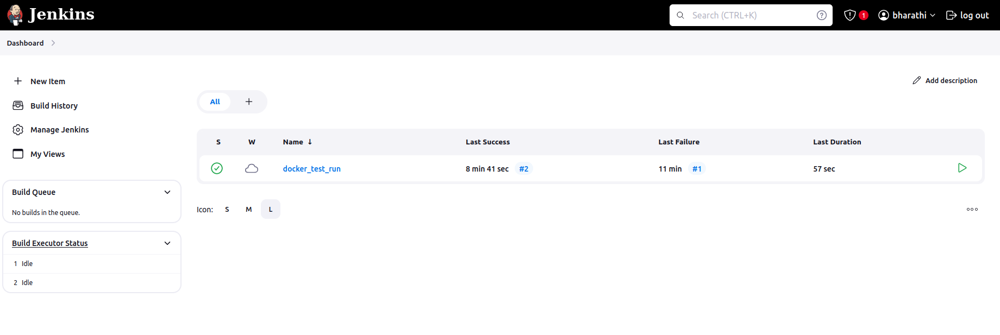
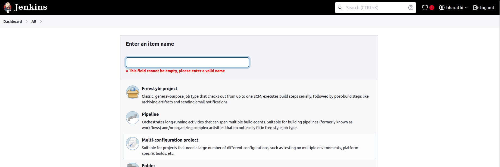
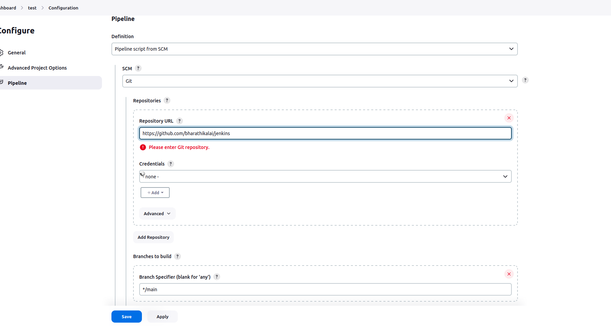
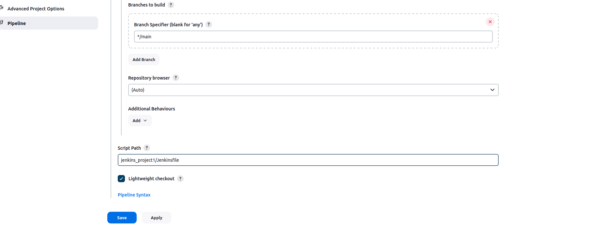
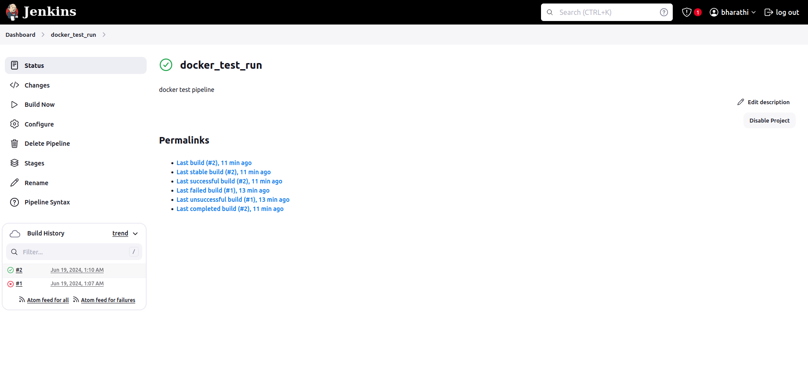

#### A simple jenkins pipeline to verify if the docker slave configuration is working as expected.

## install docker:

# step1
sudo apt install docker.io

# step 2
Give the docker permission to jenkins user 

sudo usermod -aG docker jenkins

# step 3
Restart the jenkins and docker aswell

sudo systemctl restart jenkins

sudo systemctl restart docker

### How to build jenkins pipeline ###

## Click manage jenkins
    

## Click plugins
  

## Click available plugin
  

## Search docker pipeline and install 
  

### How to create a new pipleine in jenkins

## Click new item
   

## Enter the pipeline name and select pipeline
  

## Configure your git repo link and file path

## Script path and branch main  & save

## Once you complete then run this build
  