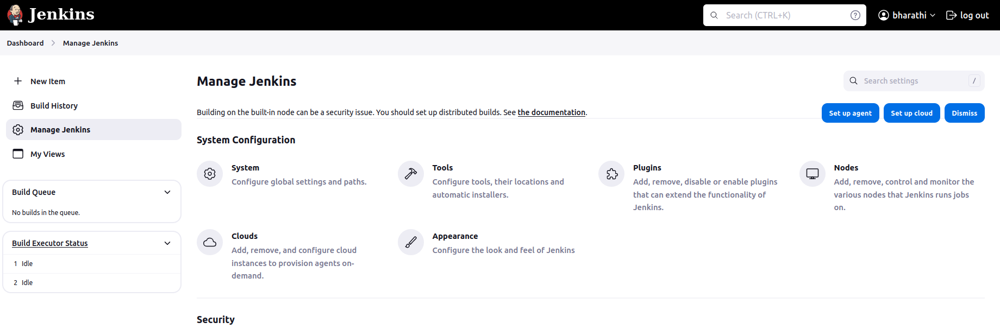
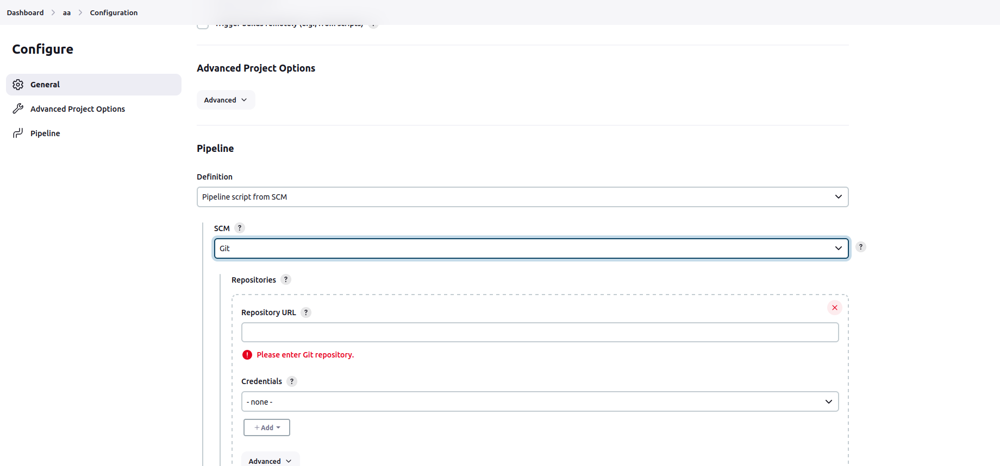

A simple jenkins pipeline to verify if the docker slave configuration is working as expected.

install docker:

sudo apt install docker.io

give the docker permission to jenkins user 

sudo usermod -aG docker jenkins

restart the jenkins and docker aswell

sudo systemctl restart jenkins

sudo systemctl restart docker

###How to build jenkins pipeline

    ##Click manage jenkins

  ##Click plugins

  ##Click available plugin

  ##Search docker pipeline and install 

###How to create a new pipleine in jenkins

   ##Click new item

  ##Enter the pipeline name and select pipeline

  ##Configure your git repo link and file path

  ##Once you complete then run this build