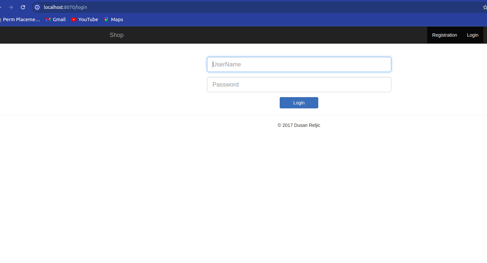

### STEP 1 : fork this git repo : https://github.com/jaiswaladi246/Ekart
### STEP 2 : use my jenkins file
### STEP 3 : cicd 
### Output (jenkins build) : 
### Output (Deploy) : 
### video link : https://www.google.com/search?client=ubuntu-sn&hs=N7d&sca_esv=6fd0d93f9f01f957&channel=fs&sxsrf=ADLYWIKW-A8xAO4BKPXPQup8Ctxfb-tQdQ:1725551945228&q=jenkins&tbm=vid&source=lnms&fbs=AEQNm0COtQ6qE5snXClm_cWqGTLX_jMP5V4l2v9LemFtanifXVoSDc4z6nO25TAUUgCi_PqCbebMxH2l70BIpVN1tqaotXuhxLKSz0A7jFus2NRBE1IzXbKlu4T6U4i0S56MHfKseo1LkFYlRacP3ANIt81UHHz_xmAfwY47cvJIyr8IDpHSNdh5YyClmG0uHzxOx4K9hegDLLwym00ZuHOE4WKtb1FDJw&sa=X&ved=2ahUKEwjj8_H1layIAxWXqFYBHbKBIqMQ0pQJegQIGhAB&biw=1850&bih=968&dpr=1#fpstate=ive&vld=cid:d4f76877,vid:WvcHQtyPcTs,st:0